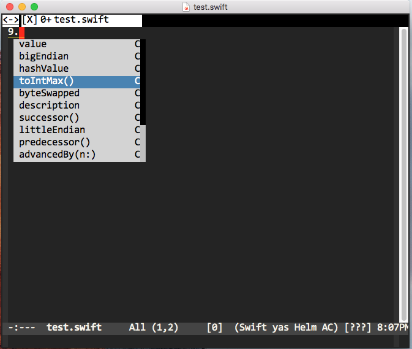

# What's this

This is a AC  source for Swift language.


# prerequisites

- json.el
- sourcekitten
  This AC source uses sourcekitten command.
  install [sourcekitten](https://github.com/jpsim/SourceKitten).


# Install 
```
(require 'auto-complete-swift)
(push 'ac-source-swift-complete ac-sources)
```
# Configuration

Set swift-compiler-args to appropreate '--compilerargs' argument of sourcekitten commandline.

# Thanks

[mikeandmore/auto-complete-clang](https://github.com/mikeandmore/auto-complete-clang)


# Copyright
 
Copyright (c) 2015 Shuji OCHI, released under the MIT license  


